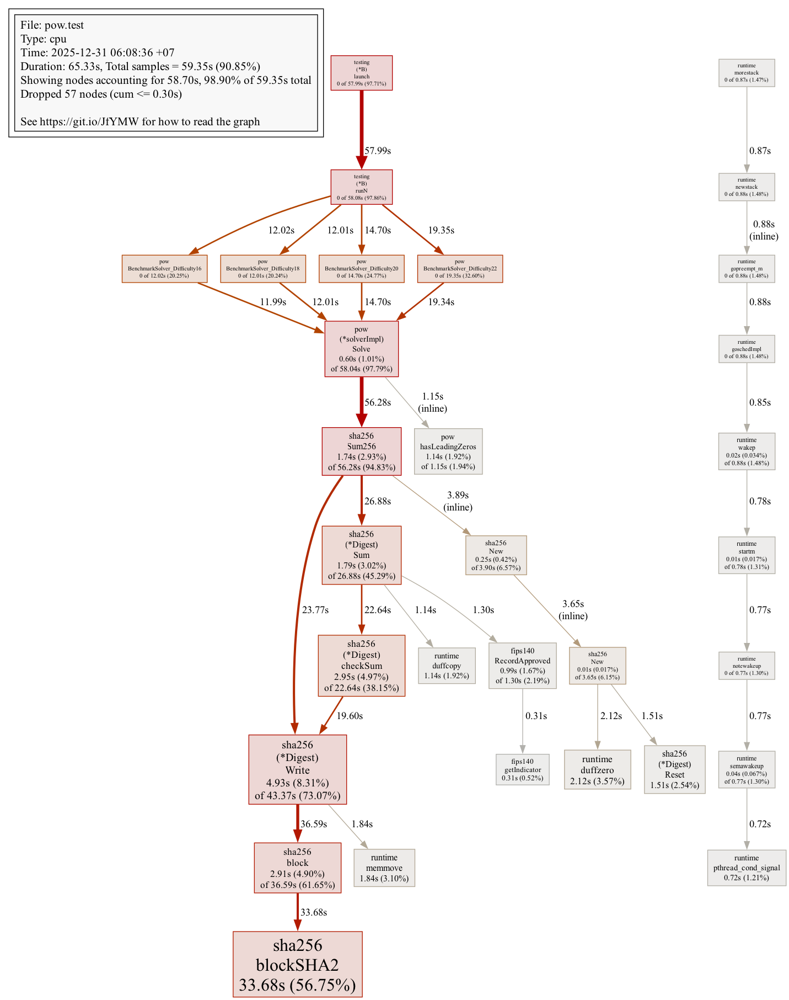
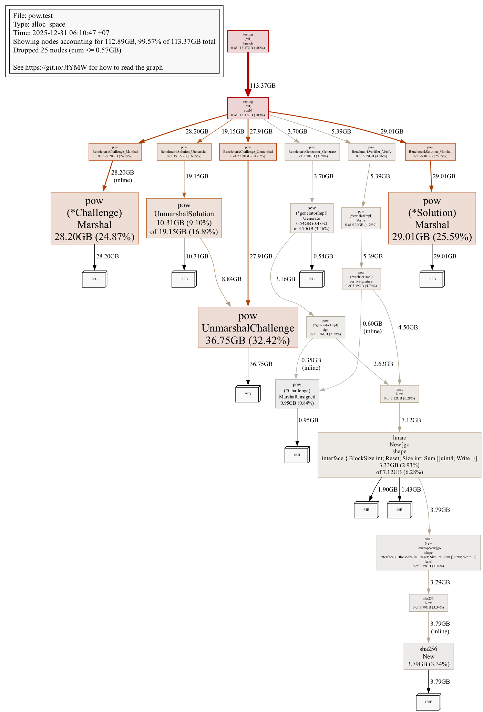
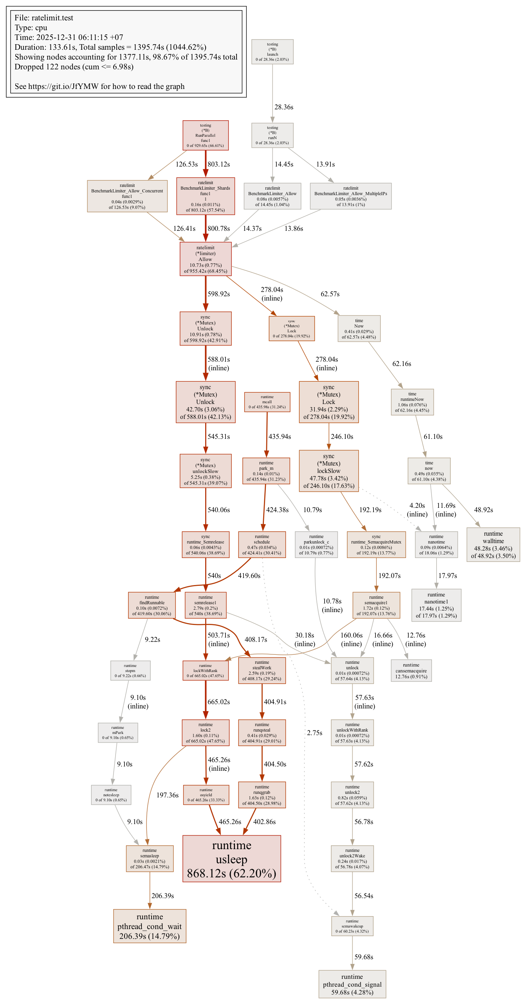

# Word of Wisdom TCP Server

A TCP server that delivers wisdom quotes, protected from DDoS attacks using a Proof of Work (PoW) challenge-response protocol based on Hashcash with SHA-256.

## Overview

This project implements a client-server system where clients must solve a computational puzzle before receiving a wisdom quote. This approach makes volumetric DDoS attacks economically infeasible by requiring attackers to expend significant CPU resources per request.

### Key Features

- **Proof-of-Work Protection**: Hashcash-based challenges with SHA-256
- **Stateless Design**: HMAC-signed challenges enable horizontal scaling
- **Dynamic Difficulty**: Automatically adjusts based on server load
- **Rate Limiting**: Per-IP token bucket algorithm
- **Connection Pooling**: Supports 10,000+ concurrent connections
- **Graceful Shutdown**: Drains existing connections before termination
- **Prometheus Metrics**: Full observability support
- **Docker Ready**: Multi-stage builds with health checks

## Architecture

```
┌─────────┐     1. REQUEST_CHALLENGE      ┌─────────┐
│         │ ─────────────────────────────▶│         │
│         │     2. CHALLENGE (PoW puzzle) │         │
│  Client │ ◀─────────────────────────────│  Server │
│         │     3. SOLUTION (nonce)       │         │
│         │ ─────────────────────────────▶│         │
│         │     4. QUOTE                  │         │
└─────────┘ ◀─────────────────────────────└─────────┘
```

### Protocol Flow

1. Client connects and sends `REQUEST_CHALLENGE`
2. Server generates a challenge with:
   - Random nonce (16 bytes)
   - Timestamp (replay protection)
   - Difficulty (leading zero bits required)
   - HMAC-SHA256 signature
3. Client finds a counter where `SHA256(challenge || counter)` has N leading zero bits
4. Server verifies solution in O(1) time
5. Server delivers a random wisdom quote

## Demo

Run the automated demo to see DDoS protection in action:

```bash
make demo
```

This will:
1. Start the server and Prometheus
2. Open Prometheus metrics dashboard in your browser
3. Run a 60-second load test with 20 concurrent workers
4. Display real-time statistics

Watch the metrics update live as the load test runs. The rate limiter will reject ~93% of requests, demonstrating the DDoS protection working as designed.

```bash
# Stop demo when done
make demo-stop
```

## Quick Start

### Using Docker Compose

```bash
# Start server and client
docker compose up

# Start with monitoring (Prometheus + Grafana)
docker compose --profile monitoring up
```

### Using Make

```bash
# Build binaries
make build

# Run tests
make test

# Run with race detector
make test-race

# Build Docker images
make docker-build

# Run integration tests
make integration-test
```

### Manual Build

```bash
# Build server and client
go build -o server ./cmd/server
go build -o client ./cmd/client

# Run server
./server

# Run client (in another terminal)
./client --server localhost:8080
```

## Configuration

### Server Environment Variables

| Variable | Default | Description |
|----------|---------|-------------|
| `SERVER_ADDRESS` | `:8080` | TCP server listen address |
| `METRICS_ADDRESS` | `:9090` | Prometheus metrics endpoint |
| `MAX_CONNECTIONS` | `10000` | Maximum concurrent connections |
| `POW_SECRET` | (required) | 32-byte HMAC secret for challenge signing |
| `POW_DIFFICULTY` | `20` | Base difficulty (leading zero bits) |
| `POW_MIN_DIFFICULTY` | `16` | Minimum difficulty |
| `POW_MAX_DIFFICULTY` | `24` | Maximum difficulty |
| `READ_TIMEOUT` | `10s` | Connection read timeout |
| `WRITE_TIMEOUT` | `10s` | Connection write timeout |
| `IDLE_TIMEOUT` | `5s` | Idle connection timeout |
| `CHALLENGE_TIMEOUT` | `60s` | Time allowed to solve challenge |
| `GRACEFUL_TIMEOUT` | `30s` | Shutdown grace period |
| `RATE_LIMIT_RPS` | `10` | Requests per second per IP |
| `RATE_LIMIT_BURST` | `20` | Burst allowance per IP |
| `MAX_CONNECTIONS_PER_IP` | `100` | Max connections from single IP |
| `LOG_LEVEL` | `info` | Log level (debug, info, warn, error) |
| `LOG_FORMAT` | `json` | Log format (json, text) |

### Client Flags

```bash
./client --help
  --server string    Server address (default "localhost:8080")
  --verbose          Enable verbose output
  --timeout duration Connection timeout (default 60s)
```

## Metrics

Prometheus metrics are exposed at `:9090/metrics`:

| Metric | Type | Description |
|--------|------|-------------|
| `pow_challenges_issued_total` | Counter | Challenges generated |
| `pow_challenges_solved_total` | Counter | Successfully verified |
| `pow_challenges_failed_total` | Counter | Failed verifications |
| `pow_challenges_expired_total` | Counter | Expired challenges |
| `pow_current_difficulty` | Gauge | Current difficulty level |
| `pow_solve_duration_seconds` | Histogram | Client solve time |
| `tcp_connections_total` | Counter | Total connections |
| `tcp_connections_active` | Gauge | Active connections |
| `tcp_connections_rejected_total` | Counter | Rejected connections |
| `tcp_connection_duration_seconds` | Histogram | Connection lifetime |
| `quotes_served_total` | Counter | Quotes delivered |
| `rate_limit_hits_total` | Counter | Rate limit triggers |

## Security

### DDoS Protection Mechanisms

1. **Proof of Work**: Clients must expend CPU cycles before getting quotes
2. **Rate Limiting**: Token bucket per IP (10 req/s, burst 20)
3. **Connection Limits**: Max 100 connections per IP, 10K total
4. **Timeouts**: Idle (5s), challenge (60s), read/write (10s)
5. **Dynamic Difficulty**: Increases under load (20-24 bits)

### Challenge Security

- **HMAC-SHA256 Signatures**: Prevents challenge forgery
- **Timestamps**: 60-second expiry prevents replay attacks
- **Clock Skew Tolerance**: 30-second tolerance for clock differences
- **Cryptographic Nonces**: `crypto/rand` for unpredictability

### Production Checklist

- [ ] Set `POW_SECRET` environment variable (32+ bytes, high entropy)
- [ ] Never use default secrets in production
- [ ] Enable TLS termination at load balancer
- [ ] Configure firewall rules
- [ ] Set up monitoring alerts

## Project Structure

```
.
├── cmd/
│   ├── client/          # CLI client
│   ├── loadtest/        # Load testing tool
│   └── server/          # TCP server
├── internal/
│   ├── config/          # Configuration management
│   ├── logging/         # Structured logging
│   ├── metrics/         # Prometheus metrics
│   ├── pow/             # Proof of Work (generator, verifier, solver)
│   ├── protocol/        # Binary message protocol
│   ├── quotes/          # Quote store
│   ├── ratelimit/       # Token bucket rate limiter
│   └── server/          # TCP server, handler, connection pool
├── Dockerfile           # Multi-stage Docker build
├── docker-compose.yml   # Docker Compose configuration
├── Makefile            # Build automation
└── prometheus.yml      # Prometheus configuration
```

## Testing

```bash
# Run all tests
make test

# Run with race detector
make test-race

# Run with coverage
make coverage

# Run integration tests (requires Docker)
make integration-test
```

### Test Coverage

| Package | Coverage |
|---------|----------|
| `internal/pow` | 97.8% |
| `internal/logging` | 97.5% |
| `internal/protocol` | 92.9% |
| `internal/quotes` | 90.9% |
| `internal/metrics` | 89.7% |
| `internal/config` | 85.5% |
| `internal/server` | 72.3% |
| `internal/ratelimit` | 80.0% |
| **Total** | **81.4%** |

## Performance

- **Verification**: <1ms (single SHA-256 hash)
- **Challenge Solve Time**: 1-25 seconds (difficulty 20-24)
- **Concurrent Connections**: 10,000+
- **Graceful Shutdown**: <30 seconds

## Benchmarks

Run benchmarks with:

```bash
# Run all benchmarks
make bench

# Run package-specific benchmarks
make bench-pow
make bench-ratelimit
make bench-protocol
make bench-server
make bench-quotes
```

### Benchmark Results

Benchmarks run on Apple M3 Ultra (darwin/arm64):

| Component | Operation | Time/Op | Allocs/Op |
|-----------|-----------|---------|-----------|
| **PoW Solver** | Difficulty 16 | 3.05 ms | 9 |
| **PoW Solver** | Difficulty 18 | 14.7 ms | 9 |
| **PoW Solver** | Difficulty 20 | 53.3 ms | 9 |
| **PoW Solver** | Difficulty 22 | 180.8 ms | 9 |
| **PoW Verifier** | Verify | 394 ns | 7 |
| **Challenge** | Marshal | 16.5 ns | 1 |
| **Challenge** | Unmarshal | 17.5 ns | 1 |
| **Protocol** | ReadMessage | 61.1 ns | 4 |
| **Protocol** | WriteMessage | 22.9 ns | 1 |
| **Rate Limiter** | Allow (single IP) | 46.7 ns | 0 |
| **Rate Limiter** | Allow (concurrent) | 162.6 ns | 0 |
| **Quotes Store** | Random | 145.7 ns | 3 |
| **Quotes Store** | Random (concurrent) | 429.8 ns | 3 |
| **Handler** | Connected | 986.3 ns | 13 |
| **Handler** | SendMessage | 99.9 ns | 3 |
| **Connection Pool** | Acquire/Release | 19.4 ns | 0 |
| **Difficulty Manager** | Current | 0.76 ns | 0 |
| **Difficulty Manager** | Update | 1.78 ns | 0 |

### Rate Limiter Sharding Performance

| Shard Count | Time/Op | Scaling |
|-------------|---------|---------|
| 1 shard | 191.0 ns | 1.0x |
| 4 shards | 248.7 ns | 0.77x |
| 8 shards | 221.7 ns | 0.86x |
| 16 shards | 157.8 ns | 1.21x |
| 32 shards | 88.2 ns | 2.17x |
| 64 shards | 54.3 ns | 3.52x |

### Profiling

Generate CPU and memory profiles:

```bash
# Generate profiles
make profile-cpu
make profile-mem

# Generate flamegraphs (requires graphviz)
make flamegraph

# Interactive profile viewer
make flamegraph-view-cpu
make flamegraph-view-mem
```

### Flamegraphs

#### PoW Solver CPU Profile
Shows SHA-256 `blockSHA2` consuming 56.75% of CPU time - expected for hash-based proof of work.



#### PoW Memory Allocations
Shows marshal/unmarshal operations dominating allocations (96-112 bytes per operation).



#### Rate Limiter CPU Profile
Shows mutex contention patterns in concurrent scenarios with goroutine scheduling overhead.



### Benchmark Comparison

Compare benchmark results after changes:

```bash
# Save current results as baseline
make bench-save

# Make changes, then compare
make bench-all
make bench-compare
```

### Stress Testing

```bash
# 1-minute stress test (50 workers)
make stress-1m

# 5-minute stress test (100 workers)
make stress-5m
```

## License

MIT
